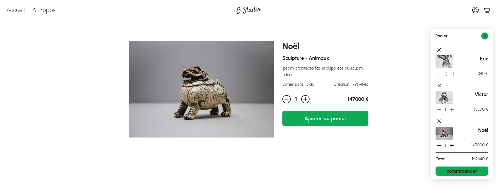

<h1 align="center" style="margin-top:3rem;"> C-Studio </h1>

 Bienvenue sur le projet C-studio, application E-commerce sur le thème de l'art développé sous Symfony6 et sveltekit.

 
     

<h2 align="center" style="margin-top:3rem;"> Avancement du projet </h2>

templates --> 100% 

Connexion / CRUD utilisateur --> 100% 

Dynamisation du contenu --> 100% 

Gestion des commandes --> 0% 

Serveur smtp --> 0% 

<h2 align="center" style="margin-top:3rem;">L'application se présente comme ceci </h2>

<h3 style="margin-top:2rem;"> Accueil </h3>

 
     

<h3 style="margin-top:2rem;"> Tableau de bord utilisateur</h3>

 
     

<h3 style="margin-top:2rem;"> Page produit</h3>

 
     

<h3 style="margin-top:2rem;"> Ajout au panier avec preview du panier</h3>

 
     

<h3 style="margin-top:2rem;"> Validation de commande</h3>

 
      

